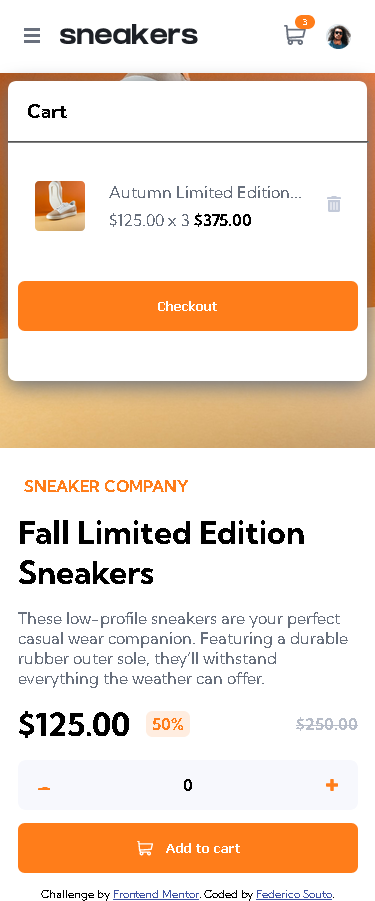
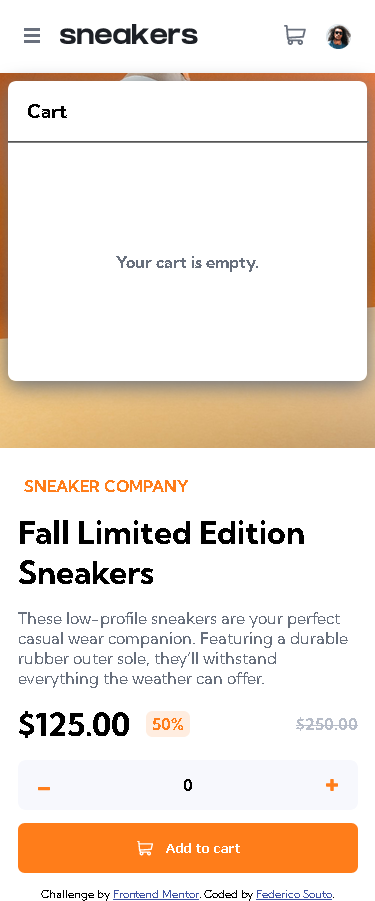
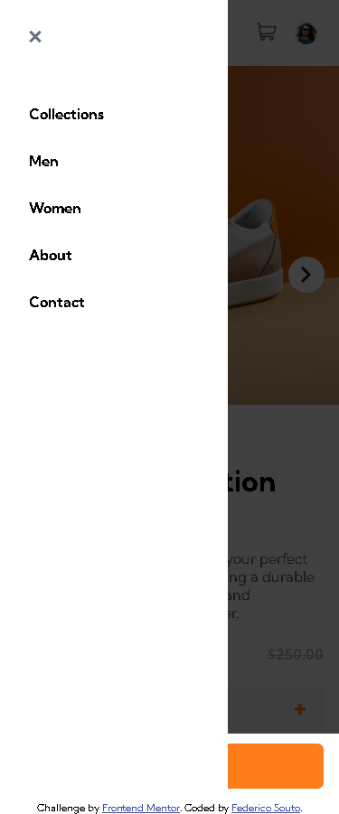

# Frontend Mentor - E-commerce product page solution

This is a solution to the [E-commerce product page challenge on Frontend Mentor](https://www.frontendmentor.io/challenges/ecommerce-product-page-UPsZ9MJp6). Frontend Mentor challenges help you improve your coding skills by building realistic projects.

## Overview

### The challenge

Users should be able to:

- Add items to the cart
- View the cart and remove items from it

### Screenshots

### Links

- Solution URL: [Solution](https://fedesouto.github.io/frontend-mentor-ecommerce-product-page/)

## My process
Mobile version ready, desktop version in progress.

### Built with

- [React](https://reactjs.org/)
- [Webpack](https://webpack.js.org/)
- CSS

